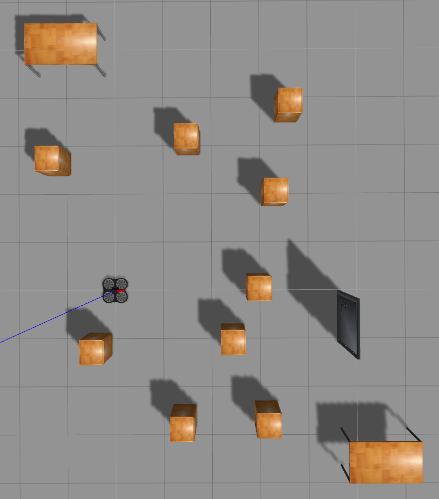
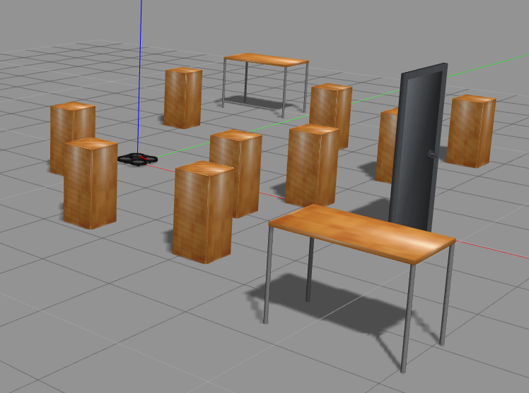

# Package drone_control
The package is for controlling a drone in simulation. 

**Platform & Tool:** Ubuntu 16.04 LTS; ROS Kinetic; [catkin kinetic](http://wiki.ros.org/catkin).

**Require Packages:**

* [ardrone_autonomy](https://github.com/AutonomyLab/ardrone_autonomy)
* [gazebo_ros_pkgs](https://github.com/ros-simulation/gazebo_ros_pkgs/tree/hydro-devel)
* [tum_ardrone](https://github.com/tum-vision/tum_ardrone)

**Description:** Two methods of controlling the drone flying smoothly w/o collisions:

* Use RL based algorithm (script `src/deep_navigation_RL.py` is for sample data collection).

    RL Course project work.

* Use object detection based algorithm (script `src/deep_navigation_obDetect.py`), which has two problems:
   
   * Can't detect when getting too close to the obstacles.
   * Can't perform smooth flying (too many sudden stops).

# RL Based Data Collection
## Test Environment
      

Coordinates of all obstacles are available at [env.csv](./src/env.csv).
## State
| distances to k nearest obstacles (1*k) | angles to k nearest obstacles (1*k) | velocity | yaw | position (1*2) | flying distance till now | \# trips completed |
|--------------------------------------------------------|---------------------------------------------------|----------|-----|------------------------------|--------------------------|--------------------|
## Action
Action space is the combination of actions for velocity and yaws:

| Action Index | Action                      |
|--------------|-----------------------------|
| 0            | velocity +; turn left       |
| 1            | velocity +; keep forward    |
| 2            | velocity +; turn right      |
| 3            | keep velocity; turn left    |
| 4            | keep velocity; keep forward |
| 5            | keep velocity; turn right   |
| 6            | velocity -; turn left       |
| 7            | velocity -; keep forward    |
| 8            | velocity -; turn right      |
## Reward
Reward is decided by whthter the drone is close to the destination, whether the drone collides into obstacles, how long it takes to get to the destination.

| Situation          | Reward |
|--------------------|--------|
| flying             | -1     |
| Collide            | -10    |
| get to destination | 100    |
## Collected Sample Data
| State                                                  |                                                   |          |     |                              |                          |                    | Action | Reward  |
|--------------------------------------------------------|---------------------------------------------------|----------|-----|------------------------------|--------------------------|--------------------|--------|---------|
| distances to k nearest obstacles (1*k) | angles to k nearest obstacles (1*k) | velocity | yaw | position (1*2) | flying distance till now | \# trips completed | ac     | R_{t+1} |

Sample data file: [traj.csv](./assets/traj.csv).

## Clarifications
For simulation environment, the Coordinate space of the PTAM map (for drone using [tum_ardrone](https://github.com/tum-vision/tum_ardrone)) and the gazebo world are different. Illustration of coordinate transformation is available at [env_explain.pdf](./assets/env_explain.pdf).

To handle with the "angle" w.r.t a drone-obstacle pair, figure illustration is also available at [env_explain.pdf](./assets/env_explain.pdf).

## Setting Steps
1. Build catkin workspace with the required packages and this package in `src` folder. `catkin_make` the workspace.
2. configure all the parameters in deep_navigation.py
3. Test, e.g., create a new package for appliations ([an example launch file](./assets/RL_col_data_sim.launch)).